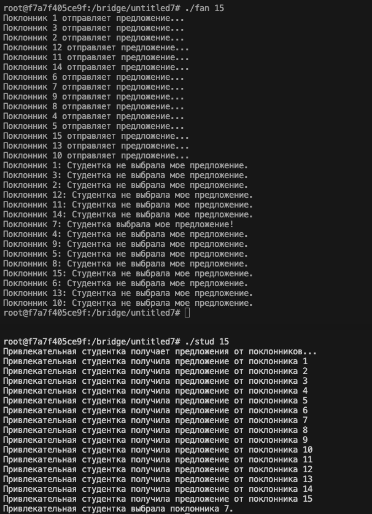

# Операционные системы
## Индивидуальное домашнее задание №2
### Вариант 27

### Шиверских Елизавета Анатольевна
###### группа БПИ225
##### Ожидаемая оценка: 8

Задание: У одной очень привлекательной студентки есть N поклонников. Традиционно в день
св. Валентина очень привлекательная студентка проводит романтический вечер с одним из поклонников. Счастливый избранник
заранее не известен. С утра очень привлекательная студентка получает N «валентинок» с различными вариантами романтического
вечера. Выбрав наиболее заманчивое предложение, студентка извещает счастливчика о своем согласии, а остальных — об отказе.

[](https://git.io/typing-svg)

### Отчёт
#### PS: Пункты про расширение отчета не прописывались явно, тк это само собой разумеющееся

### 4-5 баллов
#### Разработать консольное приложение, в котором единый родительский процесс запускает требуемое число дочерних процессов.
###
#### Требования:
#### 1. Представить сценарий решаемой задачи поясняющий, каким образом исходные сущности и их поведение отображаются в процессы и их взаимодействие
##### Введение:
Действие разворачивается в университете в преддверии Дня святого Валентина. В университете есть одна студентка, которая, по общему мнению, является очень привлекательной. У нее есть несколько поклонников из числа студентов, которые тайно влюблены в неё и мечтают провести романтический вечер в День святого Валентина.

##### Исходные сущности:

* Студентка: Центр внимания. Она является объектом внимания нескольких поклонников.
* Поклонники: Группа студентов, которые тайно влюблены в студентку и мечтают провести с ней романтический вечер.
##### Поведение:

* Поклонники отправляют свои "валентинки": Каждый из поклонников придумывает свой вариант романтического вечера и анонимно отправляет его объекту обожания в качестве "валентинки".
* Студентка выбирает одну из "валентинок": Утром в День святого Валентина она собирается выбрать одну из "валентинок" случайным образом. Студентка делает свой выбор и готовится сообщить поклоннику о своем решении.
* Студентка сообщает о выборе: После того, как она сделала свой выбор, она отправляет сообщение поклоннику, которого выбрала, чтобы пригласить его на романтический вечер. Студентка также отправляет отказные сообщения остальным поклонникам.
* Поклонники реагируют на решение: Каждый из поклонников получает ответ от студентки и реагирует соответственно. Тот, кого выбрала студентка, ощущает радость и соглашается на свидание, в то время как остальные разочарованы и печальны.
##### Процессы и их взаимодействие:

###### Процесс-студентка (Анна):
* Студентка производит выбор поклонника.
* Студентка отправляет сообщения поклонникам.
###### Процессы-поклонники:
* Каждый поклонник создает свой процесс.
* Поклонники ждут, пока студентка не сделает свой выбор.
* Каждый поклонник реагирует на решение студентки после получения сообщения.
  
##### Взаимодействие:
* Отправка "валентинок": Поклонники отправляют свои "валентинки" (создание процессов-поклонников).
* Выбор поклонника: Студентка делает свой выбор (работа с разделяемой памятью). Поклонники ждут ее решения (ожидание семафора).
* Реакция на решение студентки: Поклонники реагируют на сообщение от нее (сообщение через семафор).

##### Завершение: 
После того как студентка сделала свой выбор и поклонники получили ответы, сценарий завершается, и студентка с выбранным фанатом встречаются на романтическом вечере в День святого Валентина.
###
#### 2. В зависимости от выбранной схемы решения программа может использовать обмен данными через общую или разделяемую память. Применение семафоров: Множество процессов взаимодействуют с использованием именованных POSIX семафоров. Обмен данными ведется через разделяемую память в стандарте POSIX.
Это условие выполнено.
Для запуска программы:
```
chmod +x 4-5.sh
./4-5.sh
```
Вывод скрипта:


###
#### 3. Реализовать завершение программы в соответствии с условием задачи, а также предусмотреть корректное завершение по прерыванию с клавиатуры по соответствующему сигналу.
Это условие выполнено. При помощи соответствующего шортката можно прервать работу программы.

###
#### 4. В программе предусмотреть удаление семафоров и разделяемой памяти по ее завершению любым из способов.
Это условие выполнено. В программе присутствуют следуюшие строки:
```
// Закрытие и удаление семафоров и разделяемой памяти
    sem_close(semaphore_pokl);
    sem_close(semaphore_stud);
    sem_unlink("/pokl_semaphore");
    sem_unlink("/stud_semaphore");
    shm_unlink("/shared_memory");
```

###
### Оценка 6-7
#### В дополнение к программе на предыдущую оценку необходимо разработать программу, в которой для взаимодействия процессов используется один из двух вариантов, описанных выше, но не реализованных на предшествующую оценку.
###
#### Так как программа на предыдушую оценку реализована с использованием именованных семафоров, здесь используем неименованные.
Для запуска программы:
```
chmod +x 6-7.sh
./6-7.sh
```
Вывод скрипта:


#### Пункты, соблюденные в программе на оценку выше (например, прерывание) также корректно работают и в этом решении.
###
### Оценка 8
#### В дополнение к программам на предыдущие оценки необходимо разработать приложение, состоящую из отдельных программ–процессов, запускаемых независимо друг от друга.
###
#### Требования:
##### 1. Для завершения приложения использовать те же подходы, что и в предыдущих решениях.
Это условие выполнено.
###
##### 2. Приложение может использовать обмен данными через разделяемую память. Применение семафоров в программе возможно с помощью множества независимых процессов, которые взаимодействуют с использованием семафоров в стандарте UNIX SYSTEM V. Обмен данными ведется через разделяемую память в стандарте UNIX SYSTEM V.
Это условие выполнено.
Для запуска программы:
```
gcc 8fan.c -o fan
gcc 8student.c -o stud
./fan <кол-во поклонников>
./stud <кол-во поклонников>
```
Вывод:

(сверху находится терминал поклонника, снизу - терминал студентки)




###
##### 3. Добавленная реализация
В данной реализации добавлены две программы: программа-поклонник и программа-студентка.

Программа-студентка создает разделяемую память и семафоры. Помимо этого, выбирает случайного поклонника и отправляет ему сообщение о выборе, а также отправляет отказные сообщения остальным поклонникама. 

Программа-поклонник присоединяется к созданной памяти и семафорам, запускает процессы-поклонники и ждет, пока студентка не сделает свой выбор. После получения сообщения от студентки каждый фанат реагирует на ее решение.